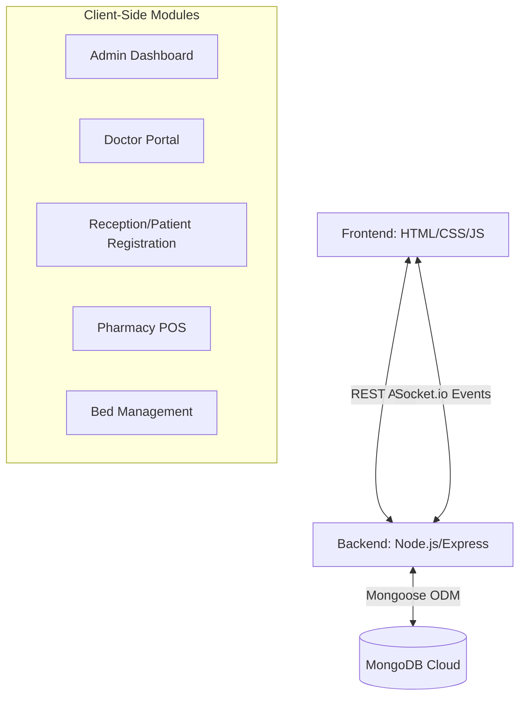

<div align="center">
  
  
  <h1>🏥 MediPulse (SmartCare) </h1>
  <p><b>An Advanced, Real-Time Full-Stack Hospital Management System</b></p>

  <!-- Badges -->
  <p>
    
    
    
    
    
    
    
  </p>
</div>

---

## 📑 Table of Contents
1. [Project Overview](#-project-overview)
2. [Key Features & Innovations](#-key-features--innovations)
3. [System Architecture](#-system-architecture)
4. [Database Schema Design](#-database-schema-design)
5. [Real-Time WebSocket Integration](#-real-time-websocket-integration)
6. [Role-Based Modules](#-role-based-modules)
7. [Installation & Deployment](#-installation--deployment)
8. [API Reference](#-api-reference)
9. [Future Scope](#-future-scope)

---

## 🌟 Project Overview
**MediPulse (SmartCare)** is an enterprise-grade Hospital Management System designed to digitize and automate the day-to-day operations of a medical facility. Moving beyond traditional CRUD applications, this project implements **Real-Time Data Synchronization** to ensure that patient queues, bed availability, and pharmacy inventories are instantly updated across all hospital departments without requiring manual page refreshes.

---

## ✨ Key Features & Innovations
- 🔐 **Unique ID-Based Authentication:** Strict Role-Based Access Control (RBAC). Doctors (`DOC-XXX`) and Staff (`REC-XXX`) access their respective modules only upon ID verification.
- ⚡ **Real-Time Queue Management:** A live token system for patients. As a doctor updates a patient's status, the patient portal and reception dashboard update instantaneously via WebSockets.
- 🛏️ **Live Bed Matrix:** Visual, real-time tracking of ward occupancy (ICU, General, etc.) to prevent overbooking and streamline admissions.
- 💊 **Integrated Pharmacy POS:** A complete Point-of-Sale system that tracks medicine stock, validates availability, processes sales, and directly imports digital prescriptions from doctors.
- 📊 **Analytical Admin Dashboard:** Centralized view for hospital administration to monitor financial value (inventory), staff rosters, and patient influx.
- 🎨 **Modern UI/UX:** Responsive, intuitive interfaces utilizing glassmorphism and modern CSS styling tailored for different healthcare roles.

---

## 🏗️ System Architecture

The application follows a robust Client-Server Model with bi-directional real-time communication.



---

## 🗄️ Database Schema Design
The system uses **MongoDB** via the **Mongoose ODM**. The database is heavily normalized with relationships across collections:
* **`Patient`**: Stores demographics, assigned doctor (`ObjectId ref 'Doctor'`), queue token, and consultation status (`waiting`, `prescribed`, `completed`).
* **`Doctor`**: Contains specialization, qualifications, generated `DOC-ID`, and active status toggle.
* **`Bed`**: Tracks bed number, ward type, occupancy status, and currently assigned patient.
* **`Medicine`**: Tracks inventory, pricing, category, and sales velocity.
* **`Prescription`**: Links `Patient`, `Doctor`, and an array of prescribed medicines.
* **`Staff`**: Stores data for non-medical staff (Receptionists, Pharmacists, Admins) with role-specific IDs.

---

## ⚡ Real-Time WebSocket Integration
Unlike standard HTTP polling, MediPulse uses **Socket.io** to push state changes directly to connected clients.
- `patient_updated`: Emitted when a doctor finishes a consultation. Automatically updates the Reception and Patient Portal queues.
- `bed_updated`: Emitted when a bed is assigned or vacated, instantly refreshing the Bed Management grid for all users.

---

## 👥 Role-Based Modules

| User Role | Module Access | Core Responsibilities |
| :--- | :--- | :--- |
| **Admin** | `9admin_dashboard.html` | Monitor analytics, register new doctors/staff, manage system data. |
| **Receptionist** | `2patient.html`, `4bed_management.html` | Register patients, assign tokens/doctors, manage bed allocations. |
| **Doctor** | `3doctor_module.html` | View waiting patients, review medical history, write digital prescriptions. |
| **Pharmacist** | `5medicine.html` | View doctor prescriptions, sell medicines, manage inventory stock. |
| **Patient** | `6patient_portal.html`, `1index.html` | View live queue status, track token number, access general hospital info. |

---

## 🚀 Installation & Deployment

### 1. Prerequisites
Ensure you have the following installed on your system:
- [Node.js](https://nodejs.org/) (v16.x or higher)
- [Git](https://git-scm.com/)
- A MongoDB URI (Local or Atlas)

### 2. Setup Instructions

```bash
# Clone the repository
git clone https://github.com/razashoeb840/MediPulse.git

# Navigate to the project directory
cd MediPulse

# Install all backend dependencies
npm install
```

### 3. Environment Variables
Create a `.env` file in the root directory:
```env
PORT=5000
MONGODB_URI=your_mongodb_connection_string
```

### 4. Initialize Database (Optional)
To populate the application with initial testing data (Medicines, Staff, etc.):
```bash
node seed.js
```

### 5. Run the Application
```bash
npm start
```
The application will be accessible at `http://localhost:5000`. Start by navigating to `8login.html` or `1index.html`.

---

## 📡 API Reference (Core Endpoints)

| Method | Endpoint | Description |
| :--- | :--- | :--- |
| `POST` | `/api/patients/register` | Registers patient, auto-generates sequential token, assigns doctor. |
| `GET` | `/api/patients/queue` | Fetches active patient queue sorted by token. |
| `POST` | `/api/prescriptions` | Generates a digital prescription and updates patient status. |
| `POST` | `/api/medicines/sell` | Validates cart, processes POS transaction, deducts DB stock. |
| `POST` | `/api/admin/register-staff`| Creates new staff and auto-generates custom `Role-ID`. |
| `GET` | `/api/admin/stats` | Aggregates data for the Admin analytics dashboard. |

---

## 🔮 Future Scope
- **Payment Gateway Integration:** Direct online payment for pharmacy bills and consultation fees.
- **AI Disease Prediction:** Integrating machine learning models to analyze patient symptoms during registration.
- **Video Consultations:** Expanding the Doctor portal to include WebRTC video calls for remote checkups.

---
<div align="center">
  <i>Developed with ❤️ to modernize healthcare administration.</i><br>
  <b>Academic Project / Software Engineering Submission</b>
</div>

*Developed with ❤️ by SHOEB and ROHIT for smarter healthcare management.*


Link-> https://smartcare-hms-avk9.onrender.com/1index.html
